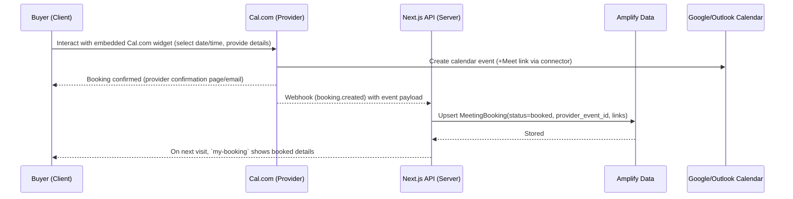
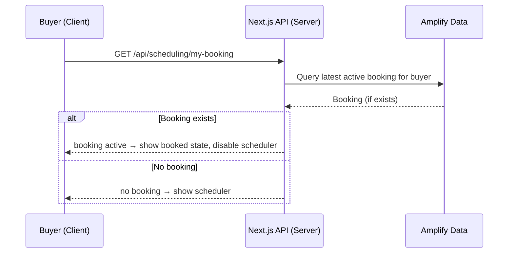

## Buyer Verification Meeting Scheduling – Deep Implementation Plan (Cal.com + Amplify)

### Objectives

- Enable buyers on `verification-pending` to book a meeting with our team using Cal.com (which connects to Google/Outlook calendars and generates Google Meet links).
- Persist each booking in Amplify so we can detect existing bookings and disable the scheduler to prevent duplicates.
- Use Cal.com to manage availability, scheduling, rescheduling, cancelation, and Meet link creation via provider connectors.
- Keep secrets secure, avoid exposing provider credentials client-side, and ensure reliable, idempotent booking.

### High-Level UX

- State A: No booking found → show scheduler (date/time selection) and button to book.
- State B: Booking exists and is active → hide scheduler, show booked time + controls to Reschedule or Cancel.
- State C: Booking canceled/expired → show scheduler again.

### Scope (Phase 1)

- Single team calendar for bookings (round-robin can follow in Phase 2).
- 30-minute meeting length (configurable), availability window based on working hours and free/busy for the team calendar.
- One active booking per buyer while verification status is pending.

### Non-goals (Phase 1)

- Complex routing forms, multi-person pooling, or advanced routing logic.
- Deep Google webhook channel renewal automation (optional in Phase 2); rely on DB + on-demand verification for now.

---

## Architecture Overview

### Components

- Next.js App Router
  - UI on `src/app/buyer/verification-pending/page.tsx` to render Cal.com embed or booked-state.
  - Route handlers in `app/api/scheduling/*` (server-only) to get current booking (`my-booking`) and receive provider webhooks.
- Amplify Data
  - New model: `MeetingBooking` to persist bookings (buyer → slot → provider event → status lifecycle).
- Cal.com (SaaS)
  - Hosts booking pages and embeddable widget, manages availability and slot generation via connected team calendars.
  - Connectors to Google Calendar/Meet handle conflict detection and conference creation.

### Flow (Booking via Cal.com)

### Flow (Verification Pending Page Gate)

---

## Detailed Steps

### 1) Cal.com Setup

- Create/Use a Cal.com organization (or team) and add team members who will take verification calls.
- Connect providers: Google Calendar (for conflict detection) and Google Meet (for conference links).
- Create an Event Type (e.g., "Verification Call", 30 minutes):
  - Define availability windows and buffer times.
  - Configure intake form fields (name, email).
  - Enable email notifications and reminders as desired.
- Configure Webhooks: point to `POST /api/scheduling/webhooks/calcom` with a secret; enable events for created, rescheduled, canceled.
- Obtain API access token (PAT or API Key) for server-to-server queries if needed (fallback reconciliation, cancel/reschedule proxy).

Security notes:

- Store `CALCOM_API_KEY` and `CALCOM_WEBHOOK_SECRET` as server-only secrets in Amplify/environment.
- Never expose provider secrets client-side; use embed public URLs only.

### 2) Amplify Data Model (new)

- Model: `MeetingBooking`
  - id: string (ULID)
  - buyer_id: string (Cognito sub or our user id)
  - buyer_email: string
  - start_time_utc: string (ISO)
  - end_time_utc: string (ISO)
  - timezone: string (IANA TZ for buyer, e.g., "America/New_York")
  - provider: string (literal: "cal.com")
  - provider_event_id: string (Cal.com booking/event id)
  - provider_event_type_id: string (Cal.com event type id or slug)
  - join_url: string (Google Meet or equivalent link from provider)
  - reschedule_url: string (self-service link from provider)
  - cancel_url: string (self-service link from provider)
  - status: enum [booked, canceled, completed, expired]
  - created_at: datetime
  - updated_at: datetime

Indexes/constraints:

- Primary: id
- GSI1: buyer_id + created_at (query latest booking per buyer)
- GSI2: provider_event_id unique (idempotent upsert from webhooks)

Lifecycle:

- booked: created via Cal.com; we store on webhook
- canceled: user/admin canceled via Cal.com; we update via webhook
- completed/expired: post-event maintenance process can move statuses

### 3) API Endpoints (Next.js App Router – server only)

- GET `/api/scheduling/my-booking` → Returns active booking for current buyer (if any)

  - Used by verification-pending page to decide whether to show the Cal.com embed.

- POST `/api/scheduling/webhooks/calcom` → Webhook receiver

  - Verify signature with `CALCOM_WEBHOOK_SECRET`.
  - Handle events: created/scheduled, rescheduled, canceled.
  - Upsert by `provider_event_id`; update fields (times, links, status).

- Optional: POST `/api/scheduling/cancel` and `/api/scheduling/reschedule`

  - Proxy to Cal.com API to cancel/reschedule on behalf of the buyer (alternatively, show `cancel_url`/`reschedule_url`).

- Optional: GET `/api/scheduling/sync-from-provider`
  - For reconciliation: query Cal.com API by buyer email to backfill if a webhook was missed.

### 4) Verification Pending Page Logic

- On load (server call): fetch `/api/scheduling/my-booking`.
  - If active booking exists: render booked details, hide/disable the Cal.com embed.
  - Else: render the Cal.com inline embed (prefill buyer name/email via embed params if supported).
- Provide “Reschedule” and “Cancel” buttons using provider `reschedule_url` and `cancel_url` (or proxy APIs if needed).
- Show clear copy: “You have scheduled your verification call on <date/time>. We’ll contact you then.”

### 5) Availability & Slots (Provider-Managed)

- Working hours and buffers are defined in the Cal.com Event Type.
- Cal.com handles slot generation and calendar conflict checks via connected calendars.
- Our UI simply embeds the provider widget; we do not compute slots server-side.
- Accessibility: ensure any `<iframe>` has a `title` and surrounding context is screen-reader friendly.

### 6) Prevent Double Bookings

- Gate on the `verification-pending` page: if `my-booking` returns an active booking, hide the embed.
- Enforce a single active booking per buyer at the DB layer (query active for buyer before showing embed; reconcile on webhook).
- Idempotent upsert by `provider_event_id` on webhooks to avoid duplicate records.

### 7) Notifications & Comms

- Rely on Cal.com’s confirmation and reminder emails; Google Calendar invite and Meet link are generated via connectors.
- Optional: send our own transactional email (SES/Amplify) with custom branding and event details.
- Optional: add SMS reminder integration in Phase 2.

### 8) Security & Secrets

- Store provider secrets server-side only: `CALCOM_API_KEY`, `CALCOM_WEBHOOK_SECRET`, and any org/team identifiers.
- Verify webhook signatures; reject invalid requests and log attempts.
- Log booking mutations with buyer_id and provider_event_id (no PII in logs beyond what is necessary).

### 9) Monitoring & Observability

- Log key flows and errors in server API routes (structured logs, redact PII).
- Metrics: bookings created, cancellations, reschedules, webhook failures, reconciliation actions.
- Alerts on elevated failure rates to Slack/email.

### 10) Admin/Support Operations (MVP)

- Simple internal list view (protected route) to search bookings by buyer/email/date.
- Manual cancel/reschedule via opening provider links or calling proxy endpoints.

---

## Failure Handling & Edge Cases

- Webhook delays/failures → provide reconciliation endpoint to pull latest bookings by buyer email from Cal.com API.
- Timezone/DST changes → always store UTC; convert only at display time; Cal.com manages slot display.
- Buyer reschedules/cancels via provider UI → rely on webhooks to update DB; reconcile periodically.
- Duplicate embed interactions → provider handles conflicts; our DB gating prevents duplicates surfaced to the user.
- Meeting duration changes → update the Cal.com Event Type; no code changes required.

---

## Testing Checklist

- Integration tests for webhook receiver (created/rescheduled/canceled) and `my-booking` route.
- E2E: buyer flow on `verification-pending` for states A/B/C with Cal.com embed.
- Non-functional: ensure webhook endpoint is performant and resilient; verify signature checks.

---

## Rollout Plan

- Phase 0: Dev Cal.com org/team + dev Amplify env; webhook to dev endpoint.
- Phase 1: Staging with limited users; verify webhooks and data consistency.
- Phase 2: Production with feature flag; gradual rollout.
- Post-launch: Add reconciliation job and admin dashboard improvements.

---

## File/Module Impact Map (no code, guidance only)

- Data model: add `MeetingBooking` to `amplify/data/resource.ts`.
- Server routes (App Router):
  - `app/api/scheduling/my-booking/route.ts` (GET)
  - `app/api/scheduling/webhooks/calcom/route.ts` (POST)
  - Optional: `app/api/scheduling/cancel/route.ts` (POST)
  - Optional: `app/api/scheduling/reschedule/route.ts` (POST)
- UI: enhance `src/app/buyer/verification-pending/page.tsx` to:
  - Fetch my-booking on load (server call) and branch UI.
  - Render Cal.com embed only when no active booking.
  - Show booked-state with details and reschedule/cancel actions using provider links.

---

## Configuration & Secrets (summary)

- `CALCOM_API_KEY` (server-only)
- `CALCOM_WEBHOOK_SECRET` (server-only)
- `CALCOM_EVENT_TYPE_ID` or slug (for reference and reconciliation)
- `NEXT_PUBLIC_CALCOM_EMBED_URL` (public embed link for the event type)

---

## Future Enhancements

- Round-robin/team pools within Cal.com; routing forms/logic to direct to specific teams.
- Bi-directional reconciliation jobs (nightly) against Cal.com API.
- Buffers and dynamic durations via provider configurations.
- ICS fallback and branded transactional emails.

---

## Success Criteria

- One-click booking experience via Cal.com embed with Meet link and calendar invite.
- No duplicate bookings for a buyer in pending state.
- Reliable persistence and UI gating based on Amplify `MeetingBooking` records.
- Secure, server-only handling of provider secrets and webhook verification.
- Clear observability: can debug issues via logs and metrics.
